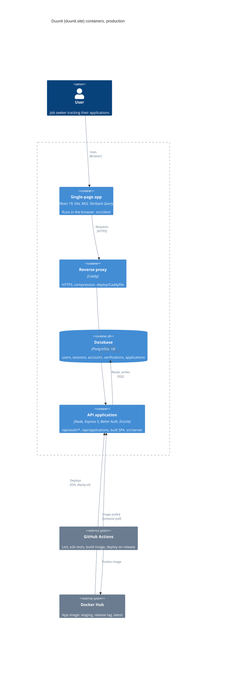
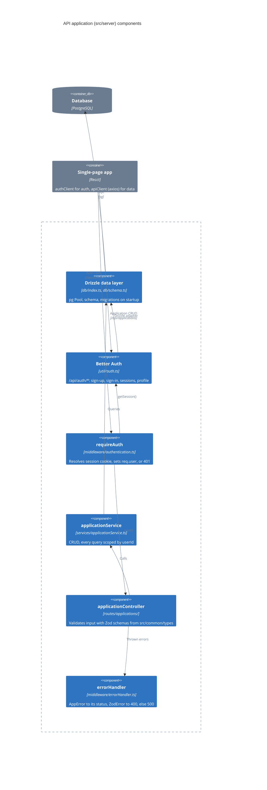
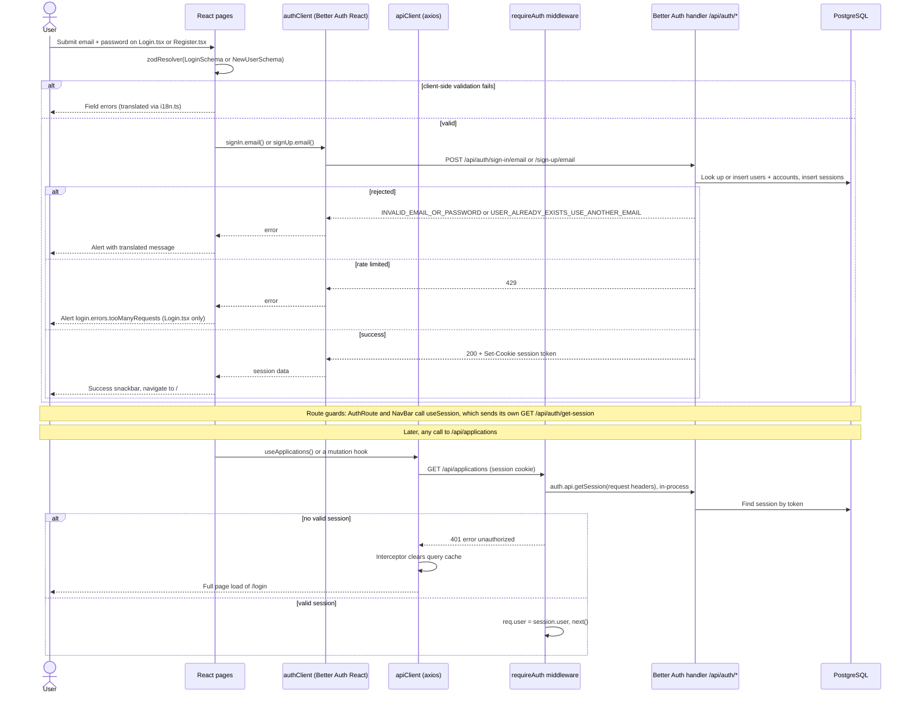
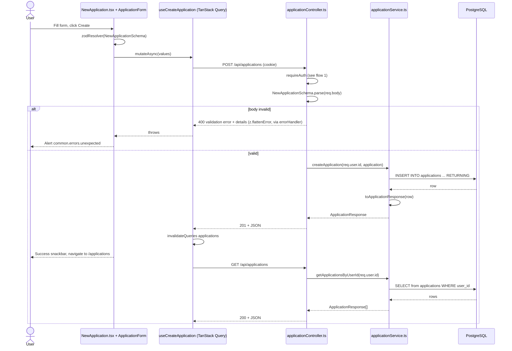

# Architecture

## Overview

Duunit is a personal job application tracker: users register, log in, and keep a list of the jobs they have applied to (company, position, status, dates, cover letter). It is a single TypeScript repo with a React 19 + Vite + MUI + TanStack Query single-page app and an Express 5 API. Data lives in PostgreSQL through Drizzle ORM, and authentication (email + password sessions) is provided by Better Auth. In production a single Node process serves both the API and the built SPA behind a Caddy reverse proxy.

## System overview (C4 model)

The overview follows the [C4 model](https://c4model.com).

### Level 2: Containers

The SPA and the API ship in the same Docker image: in production, `src/server/app.ts` serves `dist/client` for every path that isn't under `/api`. They are drawn as separate containers because they run in different places (the browser and Node).

### Level 3: Components of the API application

## Key flows

### 1. Register, log in, and authenticated requests

All auth endpoints are provided by Better Auth, not hand-written routes. `app.ts` mounts `toNodeHandler(auth)` at `/api/auth/*splat` _before_ `express.json()`, and `util/auth.ts` configures it with the Drizzle adapter (tables `users`, `sessions`, `accounts`, `verifications`), email + password login, password length limits from `#common/types/common.ts`, and a server-controlled `role` field (`input: false`, default `user`). On the client, `Register.tsx` and `Login.tsx` validate with the shared Zod schemas (`NewUserSchema`, `LoginSchema`) and call `authClient.signUp.email` / `authClient.signIn.email`. Better Auth sets a session cookie. From then on, `AuthRoute.tsx` uses `authClient.useSession()` to guard client routes, and the server's `requireAuth` middleware resolves the session from the cookie on every `/api/applications` request and sets `req.user`.

Logout is `signOut()` in `util/authClient.ts`, which calls Better Auth and then clears the whole TanStack Query cache. If a session expires or is revoked while the app is open (for example by `changePassword` with `revokeOtherSessions: true` on another device), the response interceptor in `util/apiClient.ts` catches the 401, clears the query cache and loads `/login`. Profile edits (`Profile.tsx`, `ChangePasswordForm.tsx`) also go straight to Better Auth (`authClient.updateUser`, `authClient.changePassword` with `revokeOtherSessions: true`).

### 2. Create an application and list applications

This is the core feature. `NewApplication.tsx` renders the shared `ApplicationForm`, which validates with `NewApplicationSchema` from `src/common/types/applications.ts` (trims strings, converts empty optional fields to `null`, checks URL and date). On submit, `useCreateApplication` POSTs to `/api/applications`. On the server, `applicationController.ts` re-validates the body with the _same_ schema, and `applicationService.createApplication` inserts the row with the authenticated `userId`. The service maps the DB row through `toApplicationResponse` (`services/utils.ts`), which parses it with `ApplicationResponseSchema`. If a row fails that check, it is a server bug, so the error is logged and the request returns 500 instead of 400. The client then invalidates the `['applications']` query, so `Applications.tsx` refetches `GET /api/applications` and the grid re-renders.

